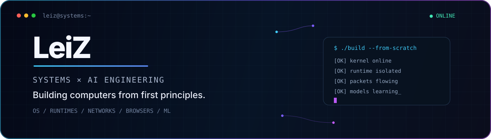

<p align="center">
  
</p>

<p align="center">
  <strong>Computer science student building systems from first principles.</strong><br />
  <sub>Operating systems · Linux runtimes · networking · browser internals · version control · machine learning</sub>
</p>

I build compact, inspectable implementations of the layers developers usually consume as abstractions. The common thread is not project count; it is turning an idea into code with explicit invariants, automated tests, reproducible commands, and honest scope boundaries.

## Flagship work

| Project | What is implemented | Evidence to inspect |
| --- | --- | --- |
| **[miniOS](https://github.com/Lei-TzuY/minios-x86)** · C / x86 | Ring-3 userspace, preemptive scheduling, COW `fork`, demand paging, VFS, filesystems, signals and IPC | [native + QEMU tests](https://github.com/Lei-TzuY/minios-x86/tree/main/tests) · [CI](https://github.com/Lei-TzuY/minios-x86/actions/workflows/tests.yml) · [benchmarks](https://github.com/Lei-TzuY/minios-x86/blob/main/tests/BENCHMARKS.md) |
| **[Mini Container Runtime](https://github.com/Lei-TzuY/mini-container-runtime)** · Go / Linux | Namespaces, cgroups v2, `pivot_root`, OverlayFS, veth networking, OCI image pulling, capabilities and seccomp | [package tests](https://github.com/Lei-TzuY/mini-container-runtime/tree/main/internal) · [CI](https://github.com/Lei-TzuY/mini-container-runtime/actions/workflows/tests.yml) · [documented limits](https://github.com/Lei-TzuY/mini-container-runtime#scope-and-limitations) |
| **[Userspace TCP/IP Stack](https://github.com/Lei-TzuY/userspace-tcpip-stack)** · C99 | Packet parsing, PCAP/PCAPNG, reassembly, TCP state/stream analysis, protocol decoders and recursive tunnels | [fixtures + tests](https://github.com/Lei-TzuY/userspace-tcpip-stack/tree/main/tests) · [ASan/UBSan + fuzz CI](https://github.com/Lei-TzuY/userspace-tcpip-stack/actions/workflows/ci.yml) · [fuzz corpus](https://github.com/Lei-TzuY/userspace-tcpip-stack/tree/main/fuzz) |
| **[Toy Browser Engine](https://github.com/Lei-TzuY/toy-browser-engine)** · Rust | HTML/CSS parsing, cascade, layout, painting, DOM/events, scripting, fetch, timers and microtasks | [unit + integration tests](https://github.com/Lei-TzuY/toy-browser-engine/tree/main/tests) · [CI](https://github.com/Lei-TzuY/toy-browser-engine/actions/workflows/tests.yml) · [architecture](https://github.com/Lei-TzuY/toy-browser-engine#architecture) |
| **[pygit](https://github.com/Lei-TzuY/pygit-sha256)** · Python | Content-addressed objects, refs, index/worktree operations, history, packs and remote workflows using SHA-256 | [test suite](https://github.com/Lei-TzuY/pygit-sha256/tree/main/tests) · [Python 3.9/3.13 CI](https://github.com/Lei-TzuY/pygit-sha256/actions/workflows/tests.yml) · [internals guide](https://github.com/Lei-TzuY/pygit-sha256/blob/main/INTERNALS.md) |
| **[Tiny Transformer + Autograd](https://github.com/Lei-TzuY/tiny-transformer-autograd)** · NumPy | Reverse-mode autodiff, GPT/Llama-style components, training, KV caching, checkpointing and numerical validation | [numerical/regression tests](https://github.com/Lei-TzuY/tiny-transformer-autograd/tree/main/tests) · [multi-version CI](https://github.com/Lei-TzuY/tiny-transformer-autograd/actions/workflows/tests.yml) · [benchmark entrypoint](https://github.com/Lei-TzuY/tiny-transformer-autograd/blob/main/src/benchmark.py) |

## How I approach engineering

```text
specify the invariant
        ↓
build the smallest complete path
        ↓
test boundaries and failure modes
        ↓
measure, document limits, repeat
```

- **Correctness over adjectives:** claims should point to a test, workflow, benchmark, or reproducible command.
- **End-to-end where integration matters:** QEMU boots, generated packet fixtures, real socket tests, and installed-package smoke tests complement unit coverage.
- **Adversarial validation:** sanitizers, fuzzing, mutation checks, numerical gradient checks, and malformed-input corpora are used where appropriate.
- **Educational scope stated plainly:** these projects expose mechanisms; they do not claim production equivalence to Linux, Docker, Chrome, Git, or mature ML frameworks.

## Research and applied systems

- **[TinyDB](https://github.com/Lei-TzuY/tinydb-c)** — a compact SQL database in C with B+ tree storage, WAL recovery, transactions, secondary indexes, query execution, and cross-platform CI.
- **[Intelligent Software Quality Assurance](https://github.com/Lei-TzuY/Quality_Assurance)** — an executable research prototype connecting machine-readable quality rules, runtime observations, traceability, and quantitative NFR scoring.
- **[Candy Defect Detection](https://github.com/Lei-TzuY/candy_detect)** — an applied computer-vision prototype spanning multi-camera capture, model workflows, operator UI, recording, annotation, and reporting. Evaluation metrics remain a documented next step.
- **[Picture Magician](https://github.com/Lei-TzuY/change-clothes)** — a Flask + ComfyUI virtual try-on and image-workflow prototype.

## Current direction

I am most interested in operating systems, runtimes, networking, storage, compilers, software quality, and ML infrastructure—especially work where correctness is observable and the layer below the abstraction is the interesting part.

<p align="center"><code>build · break · measure · harden · repeat</code></p>
